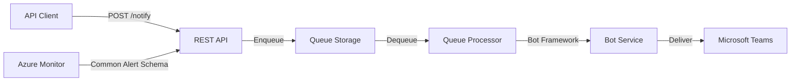

# Teams Notification Bot

Send notifications to Microsoft Teams channels via REST API or Azure Monitor alerts.



## Features

- **Alias-based routing** — named targets map to Teams channels, personal chats, or group chats
- **Adaptive Cards** — send rich, interactive card messages alongside plain text
- **Azure Monitor integration** — receive Common Alert Schema webhooks with severity-colored cards
- **Interactive bot commands** — manage aliases, inspect queues, and run diagnostics from Teams
- **Rate limiting** — per-caller throttling (60 req/60s) with `Retry-After` headers
- **Idempotency** — optional `Idempotency-Key` header prevents duplicate deliveries
- **Private networking** — VNet integration with private endpoints for storage
- **Identity-based auth** — managed identity for Azure resources, federated credential for Bot Framework (no stored secrets)

## Quick Start

### 1. Set up Entra ID prerequisites

Create two app registrations (bot + API) and configure the federated identity credential.

See [Prerequisites](docs/prerequisites.md) for step-by-step instructions.

### 2. Deploy infrastructure

```hcl
module "teams_notification_bot" {
  source  = "dsb-norge/teams-notification-bot-lz/azurerm"

  name                = "my-notification-bot"
  resource_group_name = "<resource-group>"
  bot_app_id          = "<bot-app-id>"
  api_app_id          = "<api-app-id>"
  api_app_object_id   = "<api-app-object-id>"
}
```

```bash
terraform init && terraform plan && terraform apply
```

### 3. Deploy function app

```bash
cd src/TeamsNotificationBot
dotnet publish -c Release -o ./publish
func azure functionapp publish "<function-app-name>" --dotnet-isolated
```

### 4. Install Teams app

Package the manifest and upload to Teams Admin Center, then install in target teams.

See [Deployment Guide](docs/deployment-guide.md) for full instructions.

### 5. Send your first notification

```bash
TOKEN=$(az account get-access-token \
  --resource "api://<api-app-id>" \
  --query accessToken -o tsv)

curl -X POST "https://<function-app-name>.azurewebsites.net/api/v1/notify/my-alias" \
  -H "Authorization: Bearer $TOKEN" \
  -H "Content-Type: application/json" \
  -d '{"message": "Hello from the API!", "format": "text"}'
```

## Documentation

| Document | Description |
|----------|-------------|
| [Architecture](docs/architecture.md) | System overview, message flow diagrams, data model, infrastructure topology |
| [Authentication](docs/authentication.md) | Identity map, API auth flow, Bot Framework auth, rate limiting |
| [Prerequisites](docs/prerequisites.md) | Required tools, Azure access, Entra ID setup checklist |
| [Deployment Guide](docs/deployment-guide.md) | End-to-end deployment: infrastructure, code, Teams app, verification |
| [API Reference](docs/api-reference.md) | All endpoints with request/response schemas and curl examples |
| [Bot Commands](docs/bot-commands.md) | Interactive commands by scope with usage examples |
| [Access & Roles](docs/access-and-roles.md) | Azure, Entra ID, and M365 permissions reference |
| [Troubleshooting](docs/troubleshooting.md) | Common issues, KQL diagnostic queries, monitoring |
| [Local Development](docs/local-development.md) | Offline/online modes, running tests, project structure |
| [Contributing](docs/contributing.md) | Build, test, code style, pull request guidelines |

## Infrastructure

Deployed via the companion Terraform landing zone module [terraform-azurerm-teams-notification-bot-lz](https://github.com/dsb-norge/terraform-azurerm-teams-notification-bot-lz).

Key resources created:
- Azure Function App (Flex Consumption, .NET 10 isolated worker)
- Azure Bot Service (SingleTenant, F0) with Teams channel
- Storage Account (queues + tables) behind private endpoints
- VNet with function app integration and private endpoint subnets
- Application Insights + Log Analytics with pre-built KQL query pack

## License

[ISC](LICENSE.md)
