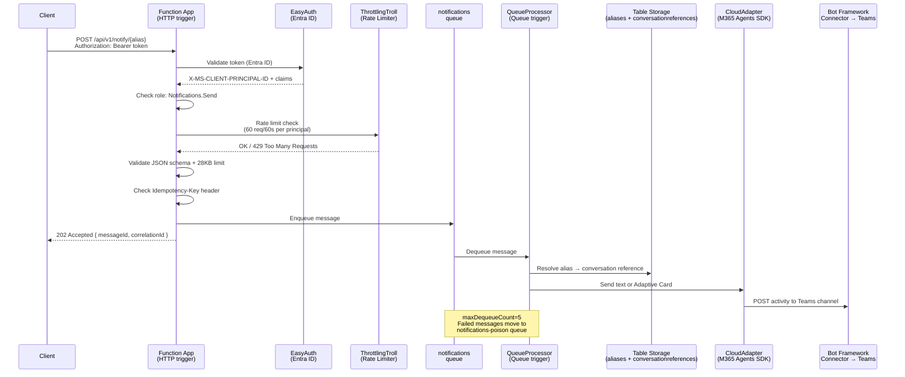
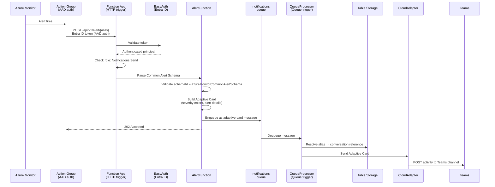
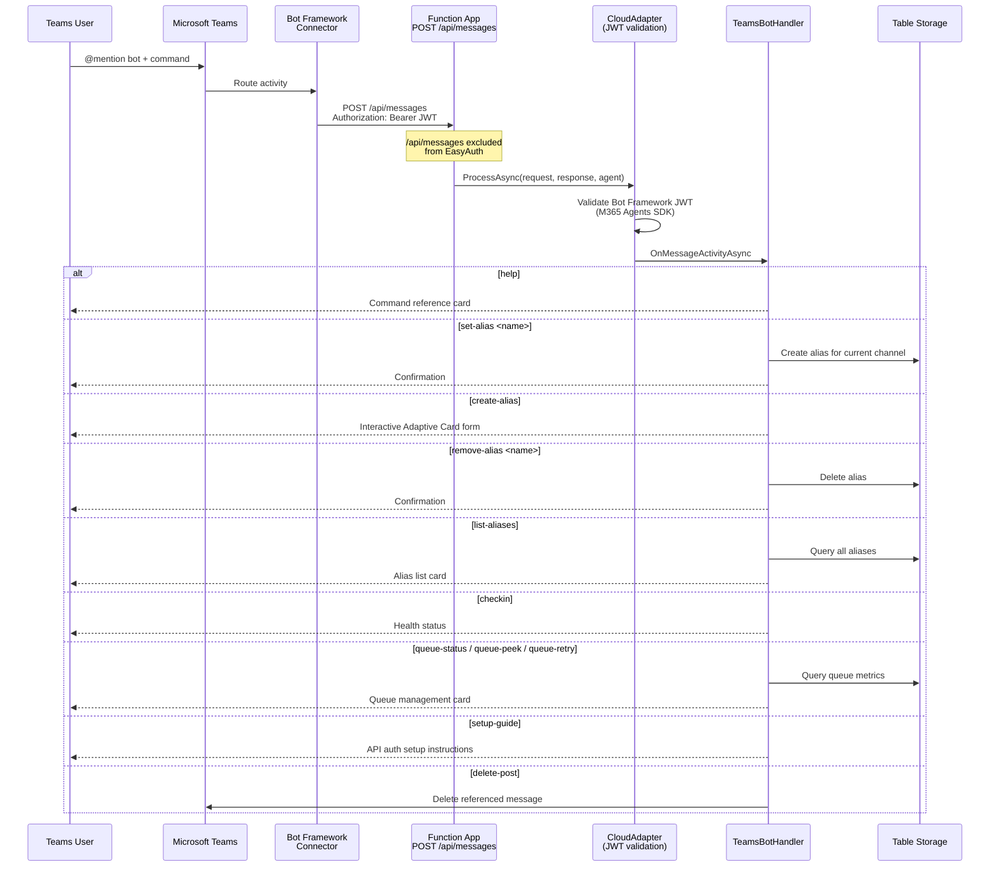
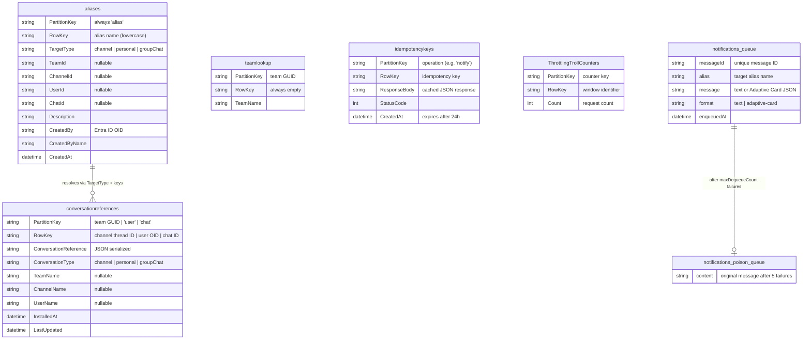
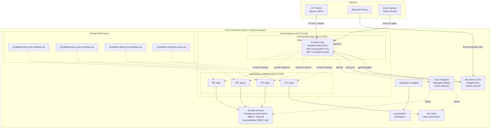

# System Architecture

A Teams Notification Bot that routes notifications from external systems to Microsoft Teams channels via REST API. It supports Azure Monitor alerts (Common Alert Schema), interactive bot commands, alias-based routing, Adaptive Cards, and proactive messaging. See the [README](../README.md) for quick start and deployment instructions.

---

## Message Flow Diagrams

### M2: Notify Flow

External systems send notifications through the REST API. Messages are validated, enqueued, and delivered asynchronously to Teams.

### M3: Alert Flow

Azure Monitor alerts arrive via Action Groups using the Common Alert Schema. The alert payload is transformed into a color-coded Adaptive Card and routed through the same queue pipeline.

### M4: Inbound Bot Messages

Users interact with the bot in Teams via @mentions and direct messages. The Bot Framework Connector delivers activities to the function app, where the M365 Agents SDK validates JWT tokens and dispatches commands.

---

## Components

### Function App

Azure Functions Flex Consumption plan (FC1 SKU), running .NET 10 on the isolated worker model. Per-function scaling means each trigger type gets its own instance group.

| Trigger Type | Function | Route / Queue | Purpose |
|---|---|---|---|
| HTTP | Health | `GET /api/health` | Liveness probe |
| HTTP | Notify | `POST /api/v1/notify/{alias}` | Send notification to alias |
| HTTP | Alert | `POST /api/v1/alert/{alias}` | Azure Monitor alert webhook |
| HTTP | CheckIn | `POST /api/v1/checkin/{alias}` | Deployment verification ping |
| HTTP | Send | `POST /api/v1/send` | Direct-target send (by team/channel/user ID) |
| HTTP | GetAliases | `GET /api/v1/aliases` | List aliases (debug mode only) |
| HTTP | OpenApi | `GET /api/v1/openapi.yaml` | OpenAPI specification |
| HTTP | BotMessages | `POST /api/messages` | Bot Framework messaging endpoint |
| Queue | QueueProcessor | `notifications` | Deliver queued messages to Teams |
| Queue | BotOperations | `botoperations` | Internal ops (channel enumeration on install) |
| Queue | NotificationsPoisonMonitor | `notifications-poison` | Alert on failed notifications |
| Queue | BotOperationsPoisonMonitor | `botoperations-poison` | Alert on failed bot operations |

**Authentication layers:**

- **API endpoints** (`/api/v1/*`): EasyAuth (Entra ID) validates Bearer tokens; AuthMiddleware checks the `Notifications.Send` app role; ThrottlingTroll enforces rate limits (60 req/60s per principal).
- **Bot endpoint** (`/api/messages`): Excluded from EasyAuth. CloudAdapter validates Bot Framework JWT tokens internally via the M365 Agents SDK.
- **Health and OpenAPI**: No authentication required.

### Storage Account

Azure Storage with shared access keys disabled. All access via RBAC (User-Assigned Managed Identity).

**Tables** (5):

| Table | Purpose |
|---|---|
| `aliases` | Maps alias names to conversation targets (channel, personal, groupChat) |
| `conversationreferences` | Stores Bot Framework conversation references (auto-populated on bot install) |
| `teamlookup` | Caches team metadata (team names) |
| `idempotencykeys` | Deduplication records with 24-hour TTL |
| `ThrottlingTrollCounters` | Rate limiter sliding window counters |

**Queues** (4):

| Queue | Purpose |
|---|---|
| `notifications` | Outbound notification messages pending delivery |
| `notifications-poison` | Notifications that failed delivery after 5 attempts |
| `botoperations` | Internal bot operations (channel enumeration, team rename) |
| `botoperations-poison` | Failed bot operations |

### Key Vault

Stores the bot app registration client secret (used for local dev tunnel scenarios). Function app accesses Key Vault references via the User-Assigned Managed Identity. Private endpoint access only.

### Bot Service

Azure Bot Service (F0 free tier, SingleTenant app type) with the Teams channel enabled. The messaging endpoint points to `https://<function-app-name>.azurewebsites.net/api/messages`. The bot app registration requires `signInAudience = AzureADMultipleOrgs` because the Bot Framework Connector authenticates from Microsoft's `botframework.com` tenant.

### Networking

Virtual network with two subnets, private endpoints, and IP restrictions. See the [Infrastructure diagram](#infrastructure--m9) below.

### Monitoring

Application Insights backed by a Log Analytics Workspace. Includes a pre-built KQL query pack with 14 saved queries covering bot traffic, function executions, MSAL token acquisition, JWT validation events, error tracking, and end-to-end request timelines.

---

## Data Model -- M8

---

## Infrastructure -- M9

**IP restrictions on the Function App:**

| Priority | Rule | Source |
|---|---|---|
| 100 | AllowAzureBotService | `AzureBotService` service tag |
| 101-102 | AllowTeamsService | `52.112.0.0/14`, `52.122.0.0/15` (M365 infrastructure) |
| 103 | AllowAzureMonitorActionGroup | `ActionGroup` service tag |
| 200+ | Management IPs | Configurable per deployment |
| Default | Deny | All other traffic |

**Storage network rules:** Default deny with `AzureServices` bypass. Function app accesses storage exclusively through private endpoints via VNet integration. Management IPs are allowed for Terraform operations.

---

## Queue Processing

Azure Functions Flex Consumption uses **per-function scaling**: each queue trigger function runs on its own instance group, independent of HTTP triggers and other queue triggers. This means `QueueProcessor` (notifications), `BotOperations`, `NotificationsPoisonMonitor`, and `BotOperationsPoisonMonitor` each scale independently.

**Queue configuration** (from `host.json`):

| Setting | Value | Description |
|---|---|---|
| `maxDequeueCount` | 5 | Attempts before moving to poison queue |
| `batchSize` | 16 | Messages fetched per poll |
| `maxPollingInterval` | 2 seconds | Polling frequency |
| `visibilityTimeout` | 30 seconds | Retry delay after failed processing |

**Poison queue monitoring:**

When a message exceeds `maxDequeueCount`, it moves to the corresponding `-poison` queue. The `PoisonQueueMonitorFunction` triggers on poison queue messages and sends an Adaptive Card alert to the channel configured by the `PoisonAlertAlias` environment variable. To prevent cascading failures (creating `-poison-poison` queues), the monitor function catches all exceptions internally.

**Bot commands for queue management:**

| Command | Description |
|---|---|
| `queue-status` | Show message counts for all queues |
| `queue-peek` | Preview messages in a poison queue |
| `queue-retry` | Move a specific poison message back for reprocessing |
| `queue-retry-all` | Move all poison messages back for reprocessing |

---

## Contract File

The file `app/app-contract.json` serves as the shared interface between the Function App code and the Terraform infrastructure module. It is generated by `scripts/generate-contract.sh` and declares:

- **Queues**: All queue names the app reads from or writes to
- **Tables**: All table names the app requires
- **Routes**: All HTTP trigger routes and their paths
- **Environment variables**: Required app settings grouped by category (identity/storage, telemetry, bot identity, app config)
- **EasyAuth configuration**: Platform auth settings including excluded paths
- **Bot configuration**: App type, scopes, notification-only flag, and command lists

The Terraform module reads this contract to create storage queues, configure app settings, and ensure infrastructure matches the app's expectations. This decouples infrastructure changes from application changes while maintaining a verifiable contract between the two.

---

## Related Documentation

| Document | Description |
|---|---|
| [README](../README.md) | Quick start, deployment, and usage |
| [deployment-guide.md](deployment-guide.md) | End-to-end deployment walkthrough |
| [access-and-roles.md](access-and-roles.md) | Permissions reference and RBAC guidance |
| [authentication.md](authentication.md) | Identity, auth flows, and credential management |
