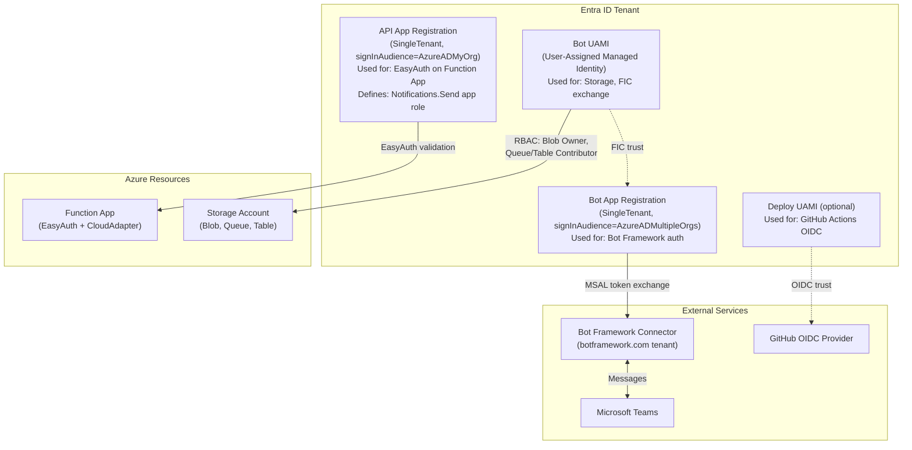
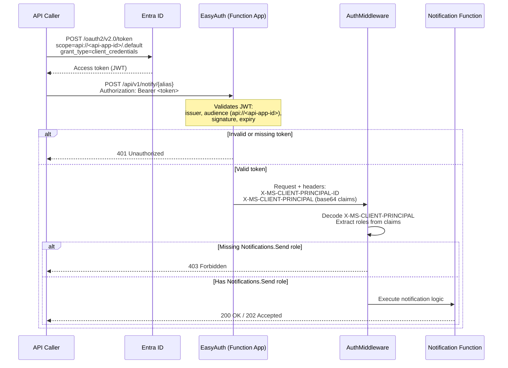
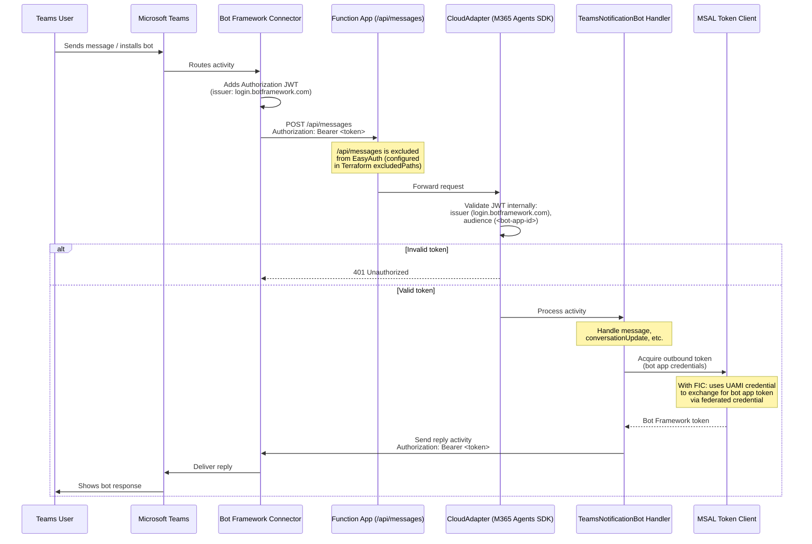

# Teams Notification Bot — Authentication & Identity

| Field   | Value |
|---------|-------|
| Status  | Active |
| Created | 2026-03-01 |
| Audience | API consumers, platform engineers, security reviewers |

---

## 1. Overview

> **Why are there multiple identities?** The bot spans two separate trust domains
> that cannot share a single credential. Entra ID handles API callers and Azure
> resource access, while Bot Framework authenticates Teams message traffic through
> Microsoft's `botframework.com` tenant. Because these issuers, audiences, and trust
> models are completely separate, one identity cannot serve both. If you are only
> calling the REST API, you interact with the **API App Registration** alone — the
> other identities are internal plumbing between the bot and Teams.

The Teams Notification Bot uses **four distinct identities** to operate across two authentication
domains that do not share a trust boundary:

1. **Entra ID** — validates API callers and issues tokens for Azure resource access.
2. **Bot Framework** — authenticates message traffic between Teams and the bot, using Microsoft's
   `botframework.com` tenant as an intermediary.

Because these domains have separate issuers, audiences, and trust models, no single identity can
serve both. The result is a layered design where each identity has a narrow, well-defined purpose:

| Identity | Domain | Purpose |
|----------|--------|---------|
| Bot App Registration | Bot Framework + Entra ID | Inbound JWT validation from Bot Framework; outbound MSAL token acquisition for replies |
| API App Registration | Entra ID | EasyAuth on the Function App — validates Bearer tokens on REST API endpoints |
| Bot UAMI | Azure RBAC | Runtime access to Storage and federated credential exchange for Bot Framework tokens |
| Deploy UAMI (optional) | GitHub OIDC | CI/CD deployment via GitHub Actions without stored secrets |

Why this matters: if you are calling the notification API, you only interact with the **API App
Registration**. If you are deploying infrastructure, you interact with the **Deploy UAMI** (or your
own credentials). The Bot App Registration and Bot UAMI are internal — they handle the bot-to-Teams
plumbing automatically.

See also: [Access & Roles](access-and-roles.md) for RBAC and permission details,
[Deployment Guide](deployment-guide.md) for initial setup procedures.

---

## 2. Identity Map

The following diagram shows all four identities and the trust relationships between them.

**Key relationships:**

- **FIC (Federated Identity Credential):** The Bot UAMI has a federated credential that trusts the
  Bot App Registration. This allows MSAL to acquire Bot Framework tokens using the UAMI credential
  instead of a client secret — eliminating secret rotation.
- **EasyAuth:** The API App Registration is configured as the identity provider for the Function
  App's built-in authentication. All API endpoints (except `/api/messages`) require a valid Bearer
  token issued for this app's audience.
- **RBAC:** The Bot UAMI is the only identity with data-plane access to Storage.
  Neither app registration has Azure resource permissions.

---

## 3. API Authentication

When an external system sends a notification through the REST API, the following sequence occurs.

**Important details:**

- The `appRoleAssignmentRequired` property is set to `true` on the API App Registration's service
  principal. This means Entra ID itself will reject token requests from principals that have not
  been granted the `Notifications.Send` app role — providing defense-in-depth before EasyAuth even
  sees the request.
- EasyAuth is a platform-level feature (runs outside your application code). It sets the
  `X-MS-CLIENT-PRINCIPAL-ID` header to the caller's Entra ID object ID, which is also used as the
  rate-limiting key.
- The token endpoint is:
  `https://login.microsoftonline.com/<tenant-id>/oauth2/v2.0/token`

### Alert Webhook Authentication

Azure Monitor Action Groups use the same API app registration for AAD-authenticated
webhook calls. The Action Group acquires a token from Entra ID with audience
`api://<api_app_id>` and includes it as a Bearer token in webhook requests. EasyAuth
on the Function App validates this token the same way it validates direct API calls.

**Deployment constraint:** Creating an Action Group with AAD webhook auth requires
the deploying identity to own the target app registration. See
[prerequisites section 3.2](prerequisites.md#32-api-app-registration).

---

## 4. Bot Framework Authentication

When a user interacts with the bot in Teams, messages flow through the Bot Framework Connector,
which acts as a trusted intermediary.

**Why `/api/messages` is excluded from EasyAuth:**

EasyAuth would strip or reject the Bot Framework Authorization header because it uses a different
issuer (`login.botframework.com`) and audience (`<bot-app-id>`) than what EasyAuth expects. The
CloudAdapter in the M365 Agents SDK performs its own JWT validation with the correct Bot Framework
parameters. This exclusion is configured in Terraform via `excludedPaths` on the auth settings
resource.

**Why `signInAudience` must be `AzureADMultipleOrgs`:**

Even though the bot is SingleTenant, the Bot Framework Connector lives in Microsoft's
`botframework.com` tenant. With `AzureADMyOrg`, the Connector cannot authenticate to the bot,
causing Teams to silently drop all messages.

---

## 5. Rate Limiting

API endpoints are protected by ThrottlingTroll middleware to prevent abuse and ensure fair access
across callers.

| Parameter | Value |
|-----------|-------|
| Window | 60 seconds (sliding) |
| Limit | 60 requests per window |
| Key | `X-MS-CLIENT-PRINCIPAL-ID` header (per-caller, set by EasyAuth) |
| Counter storage | `ThrottlingTrollCounters` Azure Table |
| Response when exceeded | `429 Too Many Requests` with `Retry-After` header |

Rate limiting is applied **after** authentication — unauthenticated requests are rejected by
EasyAuth with 401 before they reach the throttling layer. This means rate-limit counters only track
legitimate, authenticated callers.

---

## 6. Configuration Reference

Auth-related environment variables on the Function App, set by Terraform at deployment time.

| Variable | Purpose |
|----------|---------|
| `BotAppId` | Bot app registration client ID. Used for proactive messaging (`ContinueConversationAsync`) and displayed in diagnostic output. |
| `TenantId` | Entra ID tenant ID. Used for MSAL authority endpoint and token validation. |
| `ApiAppId` | API app registration client ID. Displayed in the `setup-guide` bot command to help callers configure their token requests. |
| `AzureWebJobsStorage__credential` | Set to `managedidentity`. Tells the Functions host to use managed identity instead of connection strings for storage access. |
| `AzureWebJobsStorage__clientId` | Bot UAMI client ID. Identifies which managed identity to use when multiple are assigned to the Function App. |
| `AzureWebJobsStorage__blobServiceUri` | Blob endpoint for the storage account. Used by the Functions host for internal state (leases, deployment). |
| `AzureWebJobsStorage__queueServiceUri` | Queue endpoint. Used by queue triggers and the Functions host. |
| `AzureWebJobsStorage__tableServiceUri` | Table endpoint. Used by the Functions host and application code for conversation references, aliases, and throttling counters. |
| `Connections__ServiceConnection__Settings__ClientSecret` | Bot client secret. Only used for local Dev Tunnels testing — in production, the FIC (federated identity credential) eliminates the need for secrets. Not set in the deployed Function App. |

**Note:** The M365 Agents SDK also reads from `appsettings.json` (baked into the published app) for
`TokenValidation` and `Connections` configuration. These values (`<bot-app-id>`, `<tenant-id>`,
`<uami-client-id>`) are compiled into the app and must match the Terraform-injected environment
variables. Ensure these values are consistent between `appsettings.json` and the Terraform module configuration.

---

*Last updated: 2026-03-01*
