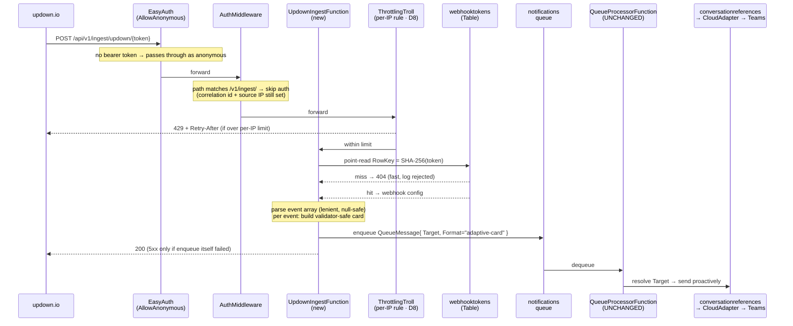
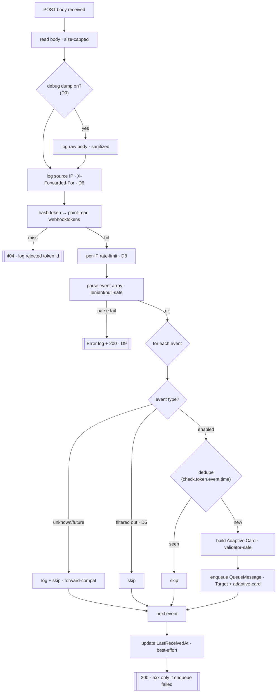

# Design: updown.io → Teams Notifier webhook ingress

| Field | Value |
|---|---|
| Status | Approved for implementation |
| Supersedes | the original exploratory hand-off spec (now removed — its content, including cost/latency notes and the rejected poll alternative, is folded into this document, see §16) |
| Audience | app developers (this repo) + platform engineers (Terraform module + consumer config) |
| Companion docs | [implementation-plan.md](./implementation-plan.md), [manual-verification.md](./manual-verification.md) |

This document records the **functional and technical design** that was landed through discussion.
It reflects a set of explicit decisions (§2). Where the exploratory spec proposed something
different, this document wins.

---

## 1. Goal

Let [updown.io](https://updown.io) deliver uptime/SSL/performance alerts into Teams **through the
existing notifier bot**, so they get the same branding and delivery path as our other alerts —
via a **webhook push** to a new, isolated, anonymous ingress route on the function app.

updown webhooks are **unsigned and carry no secret header** (confirmed against the live API — the
`custom_headers` field in the payload is the *monitored target's* request headers, not something
attachable to the webhook). Therefore origin assurance rests on a **high-entropy secret token in
the URL** (primary control) plus **source-IP observation** (deferred enforcement — see §7).

---

## 2. Decisions (locked)

| # | Decision | Rationale |
|---|---|---|
| D1 | **Anonymous route** `POST /api/v1/ingest/updown/{token}`. Path shaped as `/api/v1/ingest/{source}/{token}`; internals are source-agnostic, updown is the first adapter. | Trust-zone isolation; future SaaS onboard without new plumbing. |
| D2 | **Self-service, dynamic tokens** created by a bot command. The token is generated server-side, only its **SHA-256 is stored** (never the plaintext), in a new `webhooktokens` table. | Matches the existing `set-alias` self-service model; no infra churn per channel. |
| D3 | **No alias argument** on the command. The conversation target is captured from *where the command is run* (like `set-alias`); the token itself is the routing key. | The user wanted entropy in the token, not a guessable alias, and no alias-namespace coupling. |
| D4 | **No Key Vault, no updown API key, no origin verification** in v1. Accept the webhook at face value; the secret token is the control. | Simplest; multi-account becomes trivial (see §6). |
| D5 | **Per-webhook config**: human-readable `description`, an `updownAccount` label, and an **event filter**. Default enabled events = **all except `check.performance_drop`**. | Operability; e.g. a test env in shutdown wants only SSL events. |
| D6 | **Dynamic in-app IP allowlist is DEFERRED**, gated on confirming we can obtain usable webhook source IPs. **Source-IP logging is in scope now** (observe first). | updown does not document that webhooks egress from the published `ips.updown.io` node IPs; enforcing blindly risks dropping real alerts. |
| D7 | **Site inbound is opened** (network layer); security is EasyAuth+role on `/api/v1/*` and token on `/ingest`. | App Service IP restrictions are whole-app (no per-path); a public webhook is inherently public; AAD routes stay cryptographically gated (§4). |
| D8 | **Dedicated rate-limit rule** for `/api/v1/ingest/.*`, keyed by source IP. | The existing rule keys on the EasyAuth principal, absent on anonymous calls. |
| D9 | **Debug payload dump** behind a dedicated off-by-default setting; **parse/validation failures log at Error but return `200`**; token redacted from telemetry. | Troubleshooting without leaking secrets; stop updown's 25× retry storm on malformed bodies. |
| D10 | **Generic-ready internals, updown-specific v1.** Pluggable per-source parser + card builder. | Reuse without over-building. |

---

## 3. Request flow

### 3.1 End-to-end path

### 3.2 Per-request handler decisions

**Key reuse:** the ingest handler enqueues with a **direct `Target`** (the `MessageTarget` path
already used by `SendFunction`), so `QueueProcessorFunction` needs **no changes** — it already
resolves a direct target against `conversationreferences`. The webhook row stores the same target
coordinates that `AliasEntity` does (`TargetType` + team/channel/user/chat ids), captured at
creation via the existing `ExtractConversationKeysAsync`.

---

## 4. Why opening site inbound is safe for the AAD routes

The consumer config currently sets the site's inbound access restrictions to default-deny with a
small allowlist. Because App Service IP restrictions are **whole-app** (only main-site vs. SCM,
no per-path), letting updown reach `/ingest` means allowing Internet inbound to the whole site.

This does **not** weaken `/api/v1/notify|alert|send|checkin`:

- EasyAuth runs with `require_authentication=false`, `unauthenticatedClientAction=AllowAnonymous`.
  It **validates a bearer token if present** and otherwise forwards the request as anonymous.
- `AuthMiddleware` requires the `X-MS-CLIENT-PRINCIPAL-ID` header, which **only appears when
  EasyAuth successfully validated an Entra ID token** carrying the right audience. No token → no
  header → `401`. Wrong role → `403`.
- The **SCM/Kudu (deploy) plane keeps its own IP restrictions** (`management_ip_rules`) untouched.

So the network relaxation removes a *defense-in-depth* layer on the AAD routes but not their actual
gate. This is the accepted posture (D7).

---

## 5. Data model — new `webhooktokens` table

Created at runtime by the app (`CreateIfNotExists`), like the other tables — **no module change**
(the module provisions queues, not tables).

| Field | Key | Notes |
|---|---|---|
| `PartitionKey` | `"webhook"` (constant) | small partition; `list/remove/rotate` scan it |
| `RowKey` | `SHA-256(token)` hex | enables O(1) point-read on ingest; plaintext token never stored |
| `Id` | property | short public id (e.g. 8 hex chars) shown in `list-webhooks` / used by `remove`/`rotate` |
| `Source` | property | `"updown"` (for the generic-ready shape) |
| `TargetType` | property | `channel` \| `personal` \| `groupChat` |
| `TeamId` / `ChannelId` / `UserId` / `ChatId` | properties | conversation coordinates (same shape as `AliasEntity`) |
| `Description` | property | human-readable (D5) |
| `UpdownAccount` | property | free-text label, e.g. `prod-monitoring / ops@dsb.no` — surfaced on the card so people know which account/login (D5) |
| `EnabledEvents` | property | comma-joined event types; default = all except `check.performance_drop` |
| `CreatedBy` / `CreatedByName` / `CreatedAt` | properties | audit |
| `LastReceivedAt` | property | best-effort, updated on each accepted delivery |

**Token:** 32 random bytes → base64url (~43 chars). URL: `https://{host}/api/v1/ingest/updown/{token}`.
Shown **once** at creation. Lookup on ingest: `RowKey = SHA-256(incoming token)` point-read →
miss = `404`. (A hash point-read needs no constant-time compare; the exact-key lookup doesn't
leak via timing.)

**Dedupe:** reuse `IIdempotencyService` (the `idempotencykeys` table) with a synthesized key
`updown:{check.token}:{event}:{time}`; if present, skip enqueue. updown retries up to **25×** over
days, so this matters.

---

## 6. Multi-account

Because v1 does **no** API verification (D4), an updown account's identity is functionally
irrelevant to routing — any number of accounts simply POST to their per-channel tokens. The
`UpdownAccount` label is **for humans**: it appears on the card so that when someone clicks the
downtime link they know *which updown account/email to log in with*. No secret, no API call, no
mapping logic.

---

## 7. Security model (v1)

| Threat | Control in v1 | Residual |
|---|---|---|
| Spoofing | High-entropy secret token (SHA-256 stored). Source IP **logged** (not yet enforced — D6). | If a token leaks, spoofed cards are possible. Mitigated by: no actionable card content, "unverified sender" footer, downtime link domain-gated (below). |
| Tampering | TLS in transit; strict null-safe parsing; card built by us, not passed through. | Leaked token → attacker-controlled card *text* only. |
| Repudiation | Log source IP + token **id** (never the secret) + event type + correlation id. | — |
| Info disclosure | Token stored only as SHA-256; token redacted from request telemetry; debug body-dump off by default and sanitized. | Low. |
| DoS / cost | Per-source-IP rate limit (D8); Flex scale cap; fast `404` on unknown token before parse. | Bounded. |
| Elevation / phishing | Cards carry **no** `Action.OpenUrl/Submit/Execute` and no external images (same rules as `AdaptiveCardValidator`). The only clickable link is the **downtime `details_url`**, rendered as a link **only after validating it is under `https://updown.io/`** — otherwise plain text. `check.url` (arbitrary monitored site) is **never** auto-linked. | Worst case = benign text in a channel. |

**Deferred (D6):** the dynamic IP allowlist (`ips.updown.io` DNS resolve on a timer, `webhook-source-IP` state, `show-ip-allow-list` / `update-ip-allow-list` commands, and enforcement) is **not built in v1**. We log source IPs first and use updown's [test-payload feature](https://updown.io/recipients/test) plus early real events to learn the true webhook egress ranges. Only then do we decide whether/how to enforce.

---

## 8. Card content per event

Built from the documented payloads (see [manual-verification.md](./manual-verification.md) for the
verbatim fixtures). All fields **null-safe** — a missing field is omitted, never rendered as "null".

Common header: emoji + title + severity colour. Common facts (when present): **check url**
(plain text), **updown check alias** (`check.alias`), **updown account** (from our config),
**time** (`time`). Footer: `source: updown.io (unverified sender)`.

| Event | Colour | Extra facts |
|---|---|---|
| `check.down` | Attention (red) | reason (`downtime.error` / `check.error` / `description`), down since (`downtime.started_at`) |
| `check.up` | Good (green) | recovered, downtime duration (humanized from `downtime.duration` seconds), downtime link (`downtime.details_url`, updown.io-gated) |
| `check.ssl_invalid` | Attention | `ssl.error`, cert issuer/subject (`ssl.cert.*`) |
| `check.ssl_valid` | Good | recovered |
| `check.ssl_expiration` | Warning | `ssl.days_before_expiration`, expires (`ssl.cert.to`) |
| `check.ssl_renewed` | Accent/Good | new cert expiry (`ssl.new_cert.to`) |
| `check.performance_drop` | Warning | `apdex_dropped` (string, e.g. `"47%"`) — **disabled by default** (D5) |
| *(unknown/future)* | — | **logged and skipped** (forward-compat per updown docs) |

The downtime link is on `check.up`/`check.down` events via `downtime.details_url`.

---

## 9. Bot commands (new)

Dispatched from `TeamsBotHandler.OnMessageActivityAsync` (same `StartsWith` pattern as existing
commands). Ordering: place `*-webhook` / `*-webhooks` branches so longer prefixes match first.

| Command | Behaviour |
|---|---|
| `create-webhook updown` | Run in the target channel/chat. Generates token, stores SHA-256 + captured conversation target, sets default event filter, returns the **full URL + short id once**. |
| `configure-webhook <id> …` | Update `description`, `updownAccount`, and enabled-events filter. **v1 uses text args** (form is a later enhancement). |
| `list-webhooks` | Adaptive Card listing id, source, description, account, enabled events, last-received. **Never** the secret. |
| `remove-webhook <id>` | Delete the row. |
| `rotate-webhook <id>` | Generate a new token (new `RowKey` hash), keep config, return new URL once; old token stops working. |

**Help:** add `HelpTextBuilder.Webhooks()` + a `"webhooks"`/`"webhook"` case in `HandleHelpAsync`,
list it in `Overview()` and the unknown-topic hint. `help webhooks` must be **comprehensive**:
what the endpoint is, how to create/rotate/remove, the security model (unsigned, token-is-the-secret,
rotate if leaked), the event filter + defaults, the updown-account label purpose, and how to send
a test payload from updown.

Queue-command authorization pattern (`IsAuthorizedForQueueCommandsAsync` = any valid Entra ID)
is the model for gating these management commands.

---

## 10. Rate limiting (D8)

The existing rule (`UriPattern = "/api/v1/.*"`, keyed by `X-MS-CLIENT-PRINCIPAL-ID`) returns `null`
identity for anonymous ingest calls; ThrottlingTroll skips a rule when its `IdentityIdExtractor`
returns null, so that rule effectively won't limit `/ingest` — **to be confirmed by a test**.

Add a **dedicated rule**: `UriPattern = "/api/v1/ingest/.*"`, `IdentityIdExtractor` = source IP
(`X-Forwarded-For` first hop, fallback `RemoteIpAddress`), `FixedWindow` limit configurable via env
(`RateLimit__Ingest__PermitLimit` / `__IntervalInSeconds`, sensible default e.g. 100/60s). The
existing `ResponseFabric` already emits RFC-7807 `429` + `Retry-After`. Counters live in the
existing `ThrottlingTrollCounters` table (works across Flex instances).

---

## 11. Logging & telemetry (D9)

- **Source IP**: logged on every ingest request (plumbing already exists in `AuthMiddleware`;
  replicate in the ingest handler with `Sanitize`).
- **Debug body dump**: setting `UpdownWebhook__DebugLogPayload=true` (default off, separate from
  `DEBUG_MODE`). When on, log the raw body at Debug, run through `LogSanitizer`, tagged with
  correlation id + webhook **id** (never the token). Body is safe — the token is in the URL, not
  the body.
- **Parse/validation failure**: `Error` log with sanitized body + reason, then return `200` (a
  malformed body won't parse on retry; 200 stops updown's 25× retries). **Exception:** if enqueue
  to the `notifications` queue fails (transient storage error), return `5xx` so updown retries.
- **Token redaction**: the token is in the URL, and App Insights logs request URLs by default. Add
  an `ITelemetryInitializer`/processor that **redacts the `{token}` path segment** from request
  telemetry, and never log the raw path in our own code. `LogSanitizer` remains the CodeQL taint
  barrier for any user-controlled value we do log.

---

## 12. Contract & infrastructure changes

### 12.1 `app-requirements.json` (this repo)

- Add the ingest route to `well_known_routes` (e.g. `updown_webhook_ingest_endpoint:
  "/api/v1/ingest/updown/{token}"`), derived by `generate-requirements.sh` from the new function's
  `Route`.
- Add an EasyAuth excluded-paths signal the module can consume (see 12.2).
- Add the new bot commands to `teams_app_command_lists` in `requirements-static.json` (seed).
- Regenerate + commit (`scripts/generate-requirements.sh`); the **Validate Requirements** CI job
  fails the PR otherwise. The infra hash will change → forces a Terraform apply before deploy.

### 12.2 Terraform module `terraform-azurerm-teams-notification-bot-lz`

- **EasyAuth `excludedPaths`**: today it is hardcoded to `[bot_service.messaging_endpoint]`.
  Extend to `concat([messaging_endpoint], var.app_requirements.<additional excluded paths>)` so the
  `/api/v1/ingest/updown` prefix can be excluded. **Note:** because EasyAuth runs `AllowAnonymous`,
  this is *defensive* (an anonymous, token-less request already passes through). It matters only if
  the platform ever flips `require_authentication=true`, and it documents intent. Include it.
- Version-bump the module; update the `CHANGELOG`/README of that repo.

### 12.3 Consumer config `azure-terraform-ikt-app-platform-common-config` (reference repo — do not commit there as part of this repo's work, but the plan documents the change)

- **Open site inbound**: add an `allowed_caller_rules` entry `{ name = "public-ingest",
  cidr = "0.0.0.0/0" }` (and `::/0` if IPv6 inbound is expected) so updown can reach `/ingest`.
  SCM restrictions stay as-is. Document the posture change (§4).
- Bump the module `version` to the one from 12.2.
- No Key Vault, no new app settings, no updown IP rules (all deferred/omitted per D4/D6).

---

## 13. Explicitly out of scope for v1

- Dynamic IP allowlist: DNS resolve of `ips.updown.io`, refresh timer, `webhook-source-IP` state
  table, `show-ip-allow-list` / `update-ip-allow-list` commands, and any IP **enforcement**. (D6 —
  revisit once real webhook source IPs are known.)
- updown read-only API key, origin verification, Key Vault. (D4)
- Fan-out (one token → many channels). One token → one conversation target.
- Interactive Adaptive Card form for `configure-webhook` (text args in v1).

---

## 14. Open items — resolved during implementation

1. **ThrottlingTroll null-identity behavior** → *resolved by not depending on it.* The AAD rule uses
   a negative-lookahead pattern `"/api/v1/(?!ingest/).*"` so anonymous ingest is deterministically
   excluded from the principal-keyed rule; the ingest rule (`"/api/v1/ingest/.*"`) is keyed by
   source IP. Logic extracted to `Middleware/RateLimitPolicy.cs` and unit-tested.
2. **EasyAuth `excludedPaths` prefix form** → the generator emits the static prefix
   `"/api/v1/ingest/updown"` (the `{token}` segment stripped) in
   `bot_auth_settings.easy_auth_excluded_paths` alongside the messaging endpoint. (Consumed by the
   module in the deferred phase 7.)
3. **`HelpTextBuilder` surface** → added `Webhooks()`; wired `"webhooks"/"webhook"` in
   `HandleHelpAsync`, and listed it in `Overview()` + the unknown-topic hint.

## 15. As-built notes (differences from the original plan)

- **Fixtures are inline** (`tests/.../UpdownPayloads.cs` `const string`s), not external `.json`
  files — matches the repo's inline-JSON test convention.
- **Models** live in one file (`Models/UpdownWebhookPayload.cs`) plus `Models/UpdownEventTypes.cs`,
  matching `CommonAlertPayload.cs` — not a `Models/Updown/` subfolder.
- **Command-hint lists** (Teams 10-per-scope cap): `create-webhook` + `list-webhooks` were added to
  the **team** scope (dropping the `queue-peek`/`queue-retry` hints) and the **personal** scope;
  `configure/rotate/remove-webhook` work by typing and are covered by `help webhooks`.
- **Contract field**: `bot_auth_settings.easy_auth_excluded_paths` (list) is the signal the module
  consumes; `well_known_routes.updown_webhook_ingest_endpoint` documents the route. Infra hash after
  regeneration: `04eec911853e`.
- Body cap `UpdownWebhook__MaxBodyBytes` (default 28 KB — matches the app-wide body limit and keeps
  the Base64-encoded queue message under Storage's 64 KB cap); debug dump `UpdownWebhook__DebugLogPayload`
  (default off); dedupe stored in `idempotencykeys` under scope `updown-ingest`.

---

## 16. Context notes (cost, latency, rejected alternative)

Carried over from the superseded spec so nothing is lost:

- **Cost / hosting.** The route is HTTP-triggered on Flex Consumption, which **scales to zero** and
  bills only for active execution (min 1,000 ms/exec, then rounded to 100 ms; no always-ready
  baseline by default). updown's event volume is tiny → effectively free, likely within the monthly
  grant. 512 MB would suffice for this handler, though the app currently runs at 2048 MB for the
  .NET-isolated bot runtime. Cold start is a latency-only cost and acceptable for alerting.
- **Delivery latency.** updown re-checks before firing `check.down` (a few checks over ~seconds to a
  couple of minutes depending on check interval), so end-to-end alerting is **not** sub-second
  regardless of transport. Right-size expectations accordingly; the webhook push is still faster
  than polling.
- **Rejected alternative — polling.** We could instead poll `GET /api/checks` on a timer and diff
  state (outbound-only, API-key auth, no public ingress — security-preferable). We chose the webhook
  for near-instant delivery and no steady poll cost, accepting the public-surface trade-off (§7). If
  the public surface is ever judged too costly, the poll design is the fallback and is doable
  entirely platform-side without app changes.
